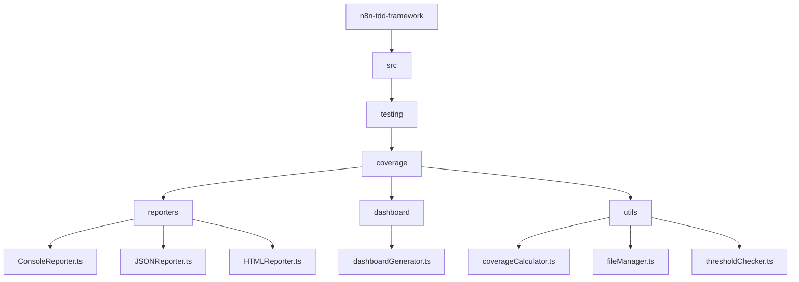

# Detailed Plan: Moving Coverage Functionality from Diane to n8n-tdd-framework

## 1. Analysis of Current Implementation

Based on my examination of the code, the coverage functionality in diane consists of:

- **Core Coverage Tracking**: Tracks node, connection, and branch coverage in n8n workflows
- **Coverage Reporting**: Generates reports in various formats (console, JSON, HTML)
- **Threshold Checking**: Verifies coverage meets specified thresholds
- **Dashboard Visualization**: Creates a visual dashboard of coverage metrics
- **File Management**: Organizes and cleans up coverage files

## 2. Implementation Plan

### 2.1 File Structure Changes



### 2.2 Implementation Steps

1. **Create Coverage Module Structure**
   - Create directory structure in n8n-tdd-framework for coverage functionality
   - Set up necessary TypeScript interfaces and types

2. **Implement Core Coverage Tracking**
   - Move coverage tracking logic from diane to n8n-tdd-framework
   - Adapt the code to work within the n8n-tdd-framework architecture
   - Ensure it's enabled by default but can be disabled

3. **Implement Coverage Reporters**
   - Create reporter classes for different output formats (console, JSON, HTML)
   - Implement a reporter factory to select the appropriate reporter

4. **Implement Dashboard Visualization**
   - Move dashboard generation code from diane
   - Create a module to generate and update the coverage dashboard

5. **Implement Threshold Checking**
   - Move threshold checking logic from diane
   - Create a configurable threshold checker

6. **Implement File Management**
   - Move file management utilities from diane
   - Create utilities for organizing and cleaning up coverage files

7. **Update CLI and Configuration**
   - Update the CLI to include coverage-related commands
   - Add configuration options for coverage

8. **Update Documentation**
   - Add documentation for the coverage functionality
   - Include examples of how to use it

### 2.3 Package.json Changes

Add the following scripts to n8n-tdd-framework's package.json:

```json
"scripts": {
  // Existing scripts...
  "test:coverage": "jest --coverage",
  "test:coverage:check": "node dist/coverage/utils/thresholdChecker.js",
  "test:coverage:dashboard": "node dist/coverage/dashboard/dashboardGenerator.js",
  "test:coverage:clean": "node dist/coverage/utils/fileManager.js clean"
}
```

### 2.4 Configuration Options

Add coverage configuration options to the framework:

```typescript
interface CoverageOptions {
  enabled: boolean;
  format: 'console' | 'json' | 'html' | 'all';
  outputDir: string;
  thresholds: {
    nodes: number;
    connections: number;
    branches: number;
  };
  dashboard: {
    enabled: boolean;
    outputDir: string;
  };
}
```

## 3. Migration Plan for Diane

1. **Update Diane's package.json**
   - Update n8n-tdd-framework dependency to the latest version
   - Remove coverage-related scripts that are now in n8n-tdd-framework

2. **Remove Coverage Scripts from Diane**
   - Remove the following scripts:
     - check-coverage-thresholds.js
     - clean-coverage-files.js
     - generate-coverage-index.js
     - show-coverage-report.js
     - update-static-dashboard.js

3. **Update Diane's Test Scripts**
   - Update test scripts to use the coverage functionality from n8n-tdd-framework

## 4. Testing Plan

1. **Unit Tests**
   - Write unit tests for each coverage module
   - Ensure all functionality is properly tested

2. **Integration Tests**
   - Test the coverage functionality with sample workflows
   - Verify that coverage reports are generated correctly
   - Check that thresholds work as expected
   - Validate dashboard generation

3. **End-to-End Tests**
   - Test the entire workflow from running tests to generating reports and dashboards
   - Verify that all components work together correctly

## 5. Publishing Plan

1. **Version Bump**
   - Increment the version number in package.json (e.g., from 0.9.0 to 0.10.0)
   - Update the CHANGELOG.md with the new features

2. **Build and Test**
   - Build the package
   - Run all tests to ensure everything works

3. **Publish to npm**
   - Use the publish.sh script to publish the package to npm

## 6. Documentation Updates

1. **README.md**
   - Add a section on coverage functionality
   - Include examples of how to use it

2. **API Documentation**
   - Document the coverage API
   - Include examples of how to configure and use it

3. **Examples**
   - Add examples of using coverage in the examples directory

## 7. Timeline

1. **Phase 1: Implementation (3-5 days)**
   - Set up directory structure
   - Implement core functionality
   - Write unit tests

2. **Phase 2: Testing and Refinement (2-3 days)**
   - Run integration and end-to-end tests
   - Fix any issues
   - Refine the implementation

3. **Phase 3: Documentation and Publishing (1-2 days)**
   - Update documentation
   - Publish to npm
   - Update diane to use the new version

## 8. Risks and Mitigations

1. **Risk: Breaking Changes**
   - Mitigation: Ensure backward compatibility
   - Mitigation: Thorough testing before publishing

2. **Risk: Performance Impact**
   - Mitigation: Optimize coverage tracking
   - Mitigation: Make it optional and configurable

3. **Risk: Integration Issues**
   - Mitigation: Thorough testing with diane
   - Mitigation: Gradual rollout and monitoring

## 9. Success Criteria

1. All coverage functionality is successfully moved from diane to n8n-tdd-framework
2. The package is published to npm with the new functionality
3. Diane is updated to use the latest version and all coverage-related scripts are removed
4. All tests pass and the coverage functionality works as expected
5. Documentation is updated to reflect the new functionality