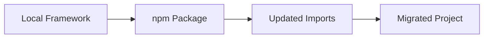

# Migration Guide: Moving to n8n-tdd-framework npm Package

This guide provides step-by-step instructions for migrating existing projects that use the local n8n workflow testing framework to the new npm package version.

## Overview



Migrating to the npm package version of the framework involves:

1. Updating dependencies in package.json
2. Updating import statements
3. Adapting to any API changes
4. Testing the migration

## Step 1: Update Dependencies

### Before Migration

Your current package.json likely has a local file reference:

```json
"dependencies": {
  "n8n-workflow-framework": "file:../framework",
  // other dependencies
}
```

### After Migration

Update your package.json to use the npm package:

```json
"dependencies": {
  "n8n-tdd-framework": "^0.9.0",
  // other dependencies
}
```

Then run:

```bash
# Remove the old dependency
npm uninstall n8n-workflow-framework

# Install the new package
npm install n8n-tdd-framework
```

## Step 2: Update Import Statements

### Before Migration

```typescript
// Importing from local framework
import { WorkflowManager } from 'n8n-workflow-framework';
import { DeclarativeTestRunner } from 'n8n-workflow-framework/dist/workflows/testing/declarative/runner';
```

### After Migration

```typescript
// Importing from npm package
import { WorkflowManager, DeclarativeTestRunner } from 'n8n-tdd-framework';
```

### Automated Update

You can use a script to automatically update import statements:

```bash
# Find and replace in all TypeScript files
find ./src -type f -name "*.ts" -exec sed -i 's/n8n-workflow-framework/n8n-tdd-framework/g' {} \;
```

## Step 3: Adapt to API Changes

The npm package version maintains the same core API but has some improvements:

### Class Name Changes

Some class names may have been standardized:

| Old Name | New Name |
|----------|----------|
| `N8nClient` | `N8nClient` (unchanged) |
| `WorkflowManager` | `WorkflowManager` (unchanged) |
| `TestRunner` | `WorkflowTestRunner` |

### Import Path Changes

All exports are now available from the root import:

```typescript
// Before
import { TestRunner } from 'n8n-workflow-framework/dist/testing/testRunner';

// After
import { WorkflowTestRunner } from 'n8n-tdd-framework';
```

### Configuration Changes

If you were using custom configuration paths:

```typescript
// Before
import { loadConfig } from 'n8n-workflow-framework/dist/config/config';

// After
import { loadConfig } from 'n8n-tdd-framework';
loadConfig({ configPath: './custom-config.json' });
```

## Step 4: Update Test Files

### Declarative Test Files

Declarative test JSON files should remain compatible without changes.

### Test Scripts

Update any test scripts in package.json:

```json
// Before
"scripts": {
  "test": "node scripts/run-tests.js",
  "test:declarative": "ts-node scripts/runDeclarativeTests.ts"
}

// After
"scripts": {
  "test": "n8n-tdd test",
  "test:declarative": "n8n-tdd test:declarative"
}
```

## Step 5: Test the Migration

Run a comprehensive test suite to ensure everything works as expected:

```bash
# Run all tests
npm test

# Run a specific test file
npm run test:declarative -- run path/to/test.json
```

Verify that:
- All tests pass
- Workflows can be created and executed
- Test reports are generated correctly

## Common Migration Issues and Solutions

### Issue: Module Not Found

```
Error: Cannot find module 'n8n-tdd-framework'
```

**Solution**: Ensure you've installed the package correctly:

```bash
npm install n8n-tdd-framework
```

### Issue: Type Definitions

```
TS2305: Module 'n8n-tdd-framework' has no exported member 'X'
```

**Solution**: Check the correct export name in the new package:

```typescript
// Check available exports
import * as framework from 'n8n-tdd-framework';
console.log(Object.keys(framework));
```

### Issue: API Differences

```
TypeError: X is not a function
```

**Solution**: Consult the API documentation for the correct method name or signature.

## Example: Complete Migration

### Original Project Structure

```
my-n8n-project/
├── package.json
├── src/
│   ├── workflows/
│   │   └── myWorkflow.ts
│   └── tests/
│       └── myWorkflow.test.ts
└── scripts/
    └── runTests.ts
```

### Migration Steps

1. Update package.json:

```json
"dependencies": {
  "n8n-tdd-framework": "^0.9.0"
}
```

2. Update imports in myWorkflow.ts:

```typescript
// Before
import { WorkflowManager } from 'n8n-workflow-framework';

// After
import { WorkflowManager } from 'n8n-tdd-framework';
```

3. Update imports in myWorkflow.test.ts:

```typescript
// Before
import { TestRunner } from 'n8n-workflow-framework/dist/testing/testRunner';

// After
import { WorkflowTestRunner } from 'n8n-tdd-framework';
```

4. Update scripts/runTests.ts:

```typescript
// Before
import { DeclarativeTestRunner } from 'n8n-workflow-framework/dist/workflows/testing/declarative/runner';

// After
import { DeclarativeTestRunner } from 'n8n-tdd-framework';
```

5. Install the new package:

```bash
npm uninstall n8n-workflow-framework
npm install n8n-tdd-framework
```

6. Run tests to verify:

```bash
npm test
```

## Advanced: Handling Custom Extensions

If you've extended the framework with custom functionality:

1. Create a separate module for your extensions:

```typescript
// myExtensions.ts
import { WorkflowManager } from 'n8n-tdd-framework';

export class ExtendedWorkflowManager extends WorkflowManager {
  // Your custom methods
}
```

2. Use your extended classes in your project:

```typescript
import { ExtendedWorkflowManager } from './myExtensions';

const manager = new ExtendedWorkflowManager();
```

## Conclusion

Migrating to the npm package version of the framework offers significant benefits in terms of maintainability, updates, and standardization. While the migration process requires some changes to your codebase, the long-term advantages make it worthwhile.

If you encounter any issues during migration, consult the [documentation](https://github.com/yourusername/n8n-tdd-framework) or open an issue on the GitHub repository.