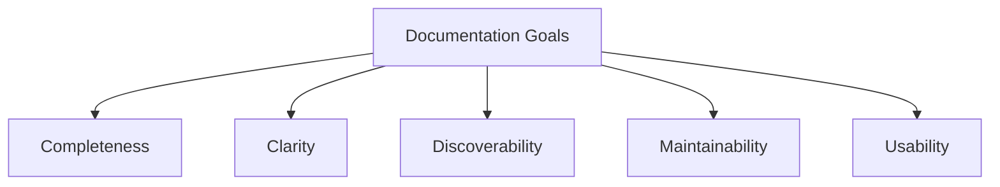
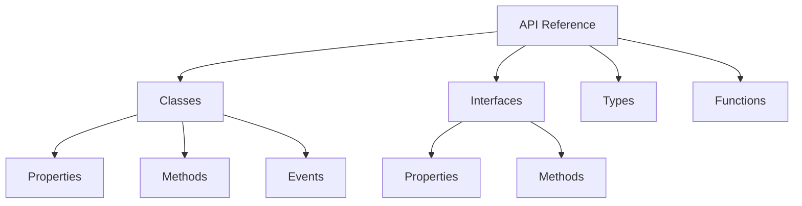
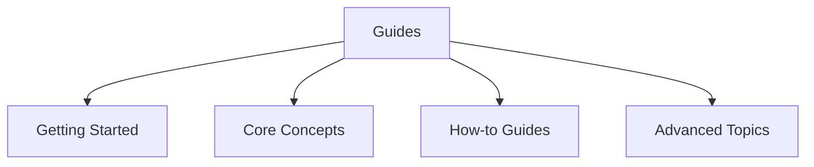
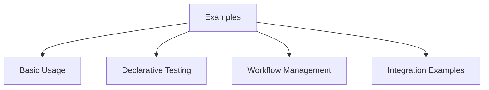
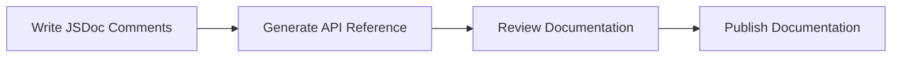
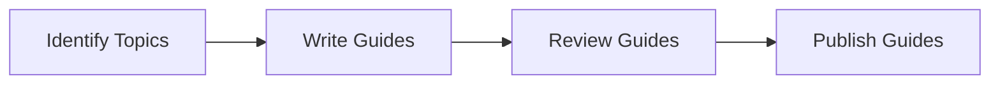
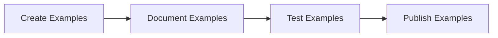

# API Documentation Guidelines for n8n-tdd-framework

This document outlines the approach for creating and maintaining API documentation for the n8n-tdd-framework.

## Documentation Goals



1. **Completeness**: Document all public APIs, classes, methods, and interfaces
2. **Clarity**: Provide clear explanations with examples
3. **Discoverability**: Make it easy to find relevant information
4. **Maintainability**: Keep documentation in sync with code
5. **Usability**: Ensure documentation is accessible and user-friendly

## Documentation Structure

### 1. API Reference



The API reference will document:

- **Classes**: All public classes with their properties and methods
- **Interfaces**: All exported interfaces
- **Types**: TypeScript type definitions
- **Functions**: Standalone functions

Each entry will include:
- Description
- Parameters
- Return values
- Examples
- Related APIs

### 2. Guides



Guides will cover:

- **Getting Started**: Installation and basic usage
- **Core Concepts**: Key concepts and architecture
- **How-to Guides**: Step-by-step instructions for common tasks
- **Advanced Topics**: In-depth coverage of advanced features

### 3. Examples



Examples will include:

- **Basic Usage**: Simple examples of core functionality
- **Declarative Testing**: Examples of declarative test configurations
- **Workflow Management**: Examples of workflow creation and management
- **Integration Examples**: Examples of integrating with other tools

## Documentation Tools

### TypeDoc

[TypeDoc](https://typedoc.org/) will be used to generate API reference documentation from TypeScript source code.

**Configuration** (typedoc.json):

```json
{
  "entryPoints": ["src/index.ts"],
  "out": "docs/api",
  "name": "n8n-tdd-framework API Documentation",
  "theme": "default",
  "excludePrivate": true,
  "excludeProtected": true,
  "excludeExternals": true,
  "includeVersion": true,
  "categorizeByGroup": true,
  "categoryOrder": ["Core", "Testing", "Utilities", "*"],
  "readme": "none",
  "plugin": ["typedoc-plugin-markdown"]
}
```

**Integration with npm scripts**:

```json
"scripts": {
  "docs": "typedoc --options typedoc.json",
  "docs:watch": "typedoc --options typedoc.json --watch"
}
```

### JSDoc Comments

All code will use JSDoc comments to provide documentation that TypeDoc can extract.

**Example**:

```typescript
/**
 * Manages n8n workflows
 * 
 * @example
 * ```typescript
 * const manager = new WorkflowManager();
 * const workflows = await manager.listWorkflows();
 * ```
 */
export class WorkflowManager {
  /**
   * Creates a new workflow
   * 
   * @param workflow - The workflow definition
   * @returns The created workflow
   * 
   * @example
   * ```typescript
   * const workflow = {
   *   name: 'My Workflow',
   *   nodes: [],
   *   connections: {}
   * };
   * const result = await manager.createWorkflow(workflow);
   * ```
   */
  async createWorkflow(workflow: Workflow): Promise<Workflow> {
    // Implementation
  }
}
```

### Markdown Documentation

Additional documentation will be written in Markdown format:

- README.md: Overview and quick start
- CONTRIBUTING.md: Contribution guidelines
- guides/*.md: In-depth guides
- examples/*.md: Example code with explanations

## Documentation Website

The documentation will be published as a website using GitHub Pages:

1. **Generated API Reference**: From TypeDoc
2. **Markdown Guides**: Converted to HTML
3. **Interactive Examples**: With embedded code editors
4. **Search Functionality**: For easy navigation

**Technology Stack**:
- [VitePress](https://vitepress.dev/) or [Docusaurus](https://docusaurus.io/) for the documentation site
- GitHub Pages for hosting
- GitHub Actions for automated deployment

## Documentation Workflow

### 1. Code Documentation



1. **Write JSDoc Comments**: Add comprehensive JSDoc comments to all code
2. **Generate API Reference**: Use TypeDoc to generate API reference
3. **Review Documentation**: Ensure accuracy and completeness
4. **Publish Documentation**: Deploy to GitHub Pages

### 2. Guide Documentation



1. **Identify Topics**: Determine what guides are needed
2. **Write Guides**: Create Markdown guides
3. **Review Guides**: Ensure accuracy and clarity
4. **Publish Guides**: Include in documentation website

### 3. Example Documentation



1. **Create Examples**: Develop example code
2. **Document Examples**: Add explanations and context
3. **Test Examples**: Ensure examples work as expected
4. **Publish Examples**: Include in documentation website

## Documentation Standards

### 1. Code Comments

- **Public APIs**: All public APIs must have JSDoc comments
- **Parameters**: All parameters must be documented
- **Return Values**: All return values must be documented
- **Examples**: Include examples for complex methods

### 2. Markdown Style

- **Headers**: Use ATX-style headers (# Header)
- **Code Blocks**: Use fenced code blocks with language specifiers
- **Links**: Use reference-style links for maintainability
- **Images**: Include alt text for accessibility

### 3. Example Code

- **Completeness**: Examples should be complete and runnable
- **Simplicity**: Examples should be as simple as possible
- **Comments**: Include comments explaining key points
- **Error Handling**: Include proper error handling

## Documentation Maintenance

### 1. Automated Checks

- **Lint Documentation**: Check for broken links, formatting issues
- **Test Examples**: Ensure examples compile and run
- **Coverage Check**: Verify all public APIs are documented

### 2. Review Process

- **Documentation Review**: Include documentation review in PR process
- **Technical Writer Review**: Have technical writers review documentation
- **User Testing**: Get feedback from users on documentation clarity

### 3. Version Management

- **Documentation Versioning**: Maintain documentation for each major version
- **Changelog**: Keep a detailed changelog of API changes
- **Deprecation Notices**: Clearly mark deprecated APIs

## Implementation Plan

### Phase 1: Initial Documentation Setup

1. **Set up TypeDoc**: Configure TypeDoc for API reference generation
2. **Create Documentation Structure**: Set up directory structure for documentation
3. **Write Core Documentation**: Document core classes and interfaces
4. **Set up Documentation Website**: Configure VitePress or Docusaurus

### Phase 2: Comprehensive Documentation

1. **Complete API Reference**: Document all public APIs
2. **Write Guides**: Create comprehensive guides
3. **Create Examples**: Develop and document examples
4. **Implement Search**: Add search functionality to documentation website

### Phase 3: Documentation Maintenance

1. **Set up Automated Checks**: Implement documentation linting and testing
2. **Create Review Process**: Establish documentation review guidelines
3. **Set up Version Management**: Configure documentation versioning

## Example Documentation Pages

### API Reference Example

```markdown
# WorkflowManager

The `WorkflowManager` class provides methods for managing n8n workflows.

## Constructor

```typescript
constructor(options?: WorkflowManagerOptions)
```

Creates a new WorkflowManager instance.

### Parameters

- `options` (optional): Configuration options for the WorkflowManager

### Example

```typescript
const manager = new WorkflowManager({
  apiUrl: 'https://n8n.example.com/api'
});
```

## Methods

### createWorkflow

```typescript
async createWorkflow(workflow: Workflow): Promise<Workflow>
```

Creates a new workflow in n8n.

#### Parameters

- `workflow`: The workflow definition

#### Returns

The created workflow with its ID and other properties.

#### Example

```typescript
const workflow = {
  name: 'My Workflow',
  nodes: [],
  connections: {}
};

const result = await manager.createWorkflow(workflow);
console.log(`Created workflow with ID: ${result.id}`);
```
```

### Guide Example

```markdown
# Getting Started with n8n-tdd-framework

This guide will help you get started with the n8n-tdd-framework package.

## Installation

```bash
npm install n8n-tdd-framework
```

## Basic Usage

First, import the WorkflowManager:

```typescript
import { WorkflowManager } from 'n8n-tdd-framework';
```

Then create a manager instance:

```typescript
const manager = new WorkflowManager();
```

## Creating a Workflow

To create a workflow:

```typescript
const workflow = {
  name: 'My First Workflow',
  nodes: [
    {
      name: 'Start',
      type: 'n8n-nodes-base.start',
      position: [100, 300],
      parameters: {}
    }
  ],
  connections: {}
};

const result = await manager.createWorkflow(workflow);
console.log(`Created workflow with ID: ${result.id}`);
```

## Testing a Workflow

To test a workflow using the declarative approach:

```typescript
import { DeclarativeTestRunner } from 'n8n-tdd-framework';

const testConfig = [
  {
    name: 'My First Test',
    workflows: [
      {
        templateName: 'simple_workflow',
        name: 'Test Workflow',
        isPrimary: true
      }
    ],
    assertions: [
      {
        description: 'Should return success',
        assertion: 'result.success === true'
      }
    ]
  }
];

const runner = new DeclarativeTestRunner();
const results = await runner.runTests(testConfig);
console.log(`Tests: ${results.passed}/${results.total} passed`);
```

## Next Steps

- Learn about [Declarative Testing](./guides/declarative-testing.md)
- Explore [Workflow Management](./guides/workflow-management.md)
- See [Examples](./examples/index.md)
```

## Conclusion

This API documentation strategy ensures that the n8n-tdd-framework package is well-documented, making it easy for users to understand and use the framework effectively. By following this approach, we can create documentation that is comprehensive, clear, discoverable, maintainable, and user-friendly.

The combination of automated API reference generation, hand-written guides, and practical examples provides users with multiple ways to learn about and use the framework, catering to different learning styles and needs.