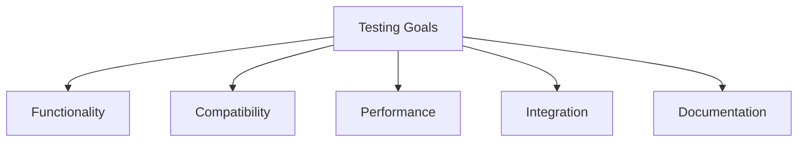
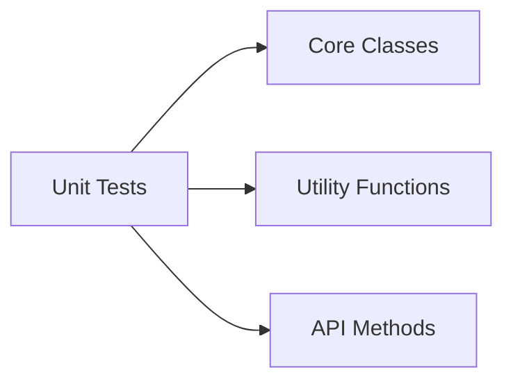
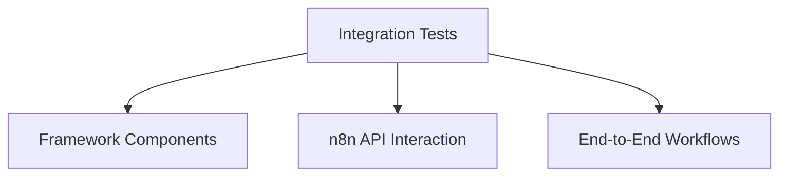
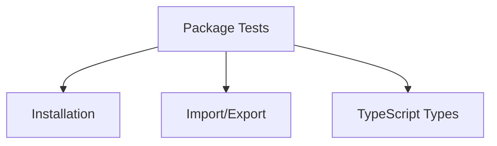
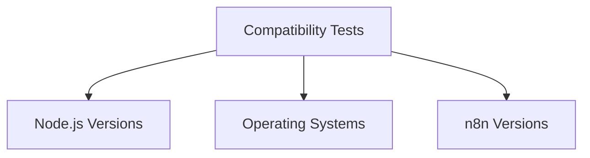
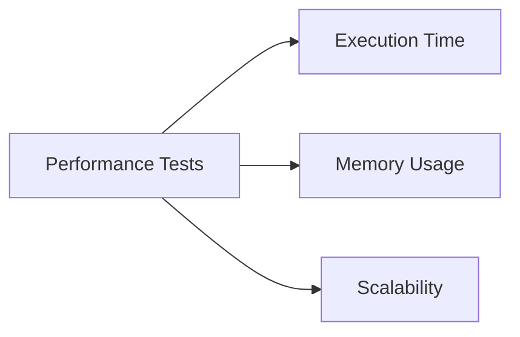
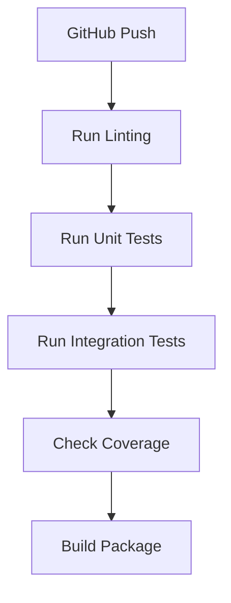

# Testing Strategy for n8n-tdd-framework

> **Status**: Planning Document - Partially Implemented
> 
> This document describes the comprehensive testing strategy for the n8n-tdd-framework.
> Some aspects (unit testing with Jest) have been implemented, while others (performance testing,
> compatibility matrix testing) remain planned for future releases.

This document outlines the comprehensive testing strategy for the n8n-tdd-framework npm package to ensure reliability, compatibility, and performance.

## Testing Goals



1. **Verify Functionality**: Ensure all framework features work as expected
2. **Ensure Compatibility**: Test across different Node.js versions and environments
3. **Validate Performance**: Confirm acceptable performance for typical use cases
4. **Test Integration**: Verify integration with n8n and other tools
5. **Check Documentation**: Ensure documentation is accurate and complete

## Testing Levels

### 1. Unit Testing



- **Scope**: Individual classes, functions, and methods
- **Tools**: Jest, ts-jest
- **Coverage Target**: 80% line coverage

**Key Areas**:
- WorkflowManager class methods
- N8nClient implementation
- Utility functions
- Configuration handling
- Declarative test runner

**Example Test**:

```typescript
describe('WorkflowManager', () => {
  let manager: WorkflowManager;
  
  beforeEach(() => {
    manager = new WorkflowManager();
  });
  
  test('should list workflows', async () => {
    // Mock API response
    jest.spyOn(manager['client'], 'get').mockResolvedValue({
      data: { data: [{ id: '1', name: 'Test Workflow' }] }
    });
    
    const workflows = await manager.listWorkflows();
    
    expect(workflows).toHaveLength(1);
    expect(workflows[0].name).toBe('Test Workflow');
  });
});
```

### 2. Integration Testing



- **Scope**: Interaction between framework components
- **Tools**: Jest, Docker for n8n instance
- **Strategy**: Test against a real or mocked n8n instance

**Key Areas**:
- Workflow creation and execution
- Test resource management
- Declarative test execution
- Error handling and recovery

**Example Test**:

```typescript
describe('Workflow Execution', () => {
  let manager: WorkflowManager;
  let workflowId: string;
  
  beforeAll(async () => {
    // Set up n8n instance in Docker
    await setupN8nDocker();
    manager = new WorkflowManager();
  });
  
  beforeEach(async () => {
    // Create a test workflow
    const workflow = loadWorkflowTemplate('simple_http_workflow');
    const result = await manager.createWorkflow(workflow);
    workflowId = result.id;
  });
  
  afterEach(async () => {
    // Clean up test workflow
    await manager.deleteWorkflow(workflowId);
  });
  
  afterAll(async () => {
    // Tear down n8n Docker instance
    await teardownN8nDocker();
  });
  
  test('should execute workflow and return results', async () => {
    const result = await manager.executeWorkflow(workflowId);
    
    expect(result).toBeDefined();
    expect(result.success).toBe(true);
  });
});
```

### 3. Package Testing



- **Scope**: Package structure, exports, and installation
- **Tools**: npm pack, example projects
- **Strategy**: Create test projects that install and use the package

**Key Areas**:
- Package installation
- Module imports
- TypeScript type definitions
- CLI functionality

**Example Test**:

```typescript
// In a separate test project
const { WorkflowManager, DeclarativeTestRunner } = require('n8n-tdd-framework');

describe('Package Exports', () => {
  test('should export WorkflowManager', () => {
    expect(WorkflowManager).toBeDefined();
    expect(typeof WorkflowManager).toBe('function');
  });
  
  test('should export DeclarativeTestRunner', () => {
    expect(DeclarativeTestRunner).toBeDefined();
    expect(typeof DeclarativeTestRunner).toBe('function');
  });
});
```

### 4. Compatibility Testing



- **Scope**: Different environments and versions
- **Tools**: GitHub Actions matrix builds, Docker
- **Strategy**: Run tests across multiple Node.js versions and OS platforms

**Key Environments**:
- Node.js: 14.x, 16.x, 18.x
- Operating Systems: Ubuntu, Windows, macOS
- n8n versions: Latest stable, LTS

**Example GitHub Actions Configuration**:

```yaml
jobs:
  test:
    runs-on: ${{ matrix.os }}
    strategy:
      matrix:
        node-version: [14.x, 16.x, 18.x]
        os: [ubuntu-latest, windows-latest, macos-latest]
    
    steps:
    - uses: actions/checkout@v3
    - name: Use Node.js ${{ matrix.node-version }}
      uses: actions/setup-node@v3
      with:
        node-version: ${{ matrix.node-version }}
    - run: npm ci
    - run: npm test
```

### 5. Performance Testing



- **Scope**: Performance metrics for typical operations
- **Tools**: Custom benchmarking scripts
- **Strategy**: Measure execution time and resource usage for key operations

**Key Metrics**:
- Workflow creation time
- Test execution time
- Memory usage during test runs
- Scalability with large workflows

**Example Test**:

```typescript
describe('Performance', () => {
  test('should execute tests within acceptable time', async () => {
    const startTime = Date.now();
    
    const runner = new DeclarativeTestRunner();
    await runner.runTestsFromFile('path/to/large-test-suite.json');
    
    const executionTime = Date.now() - startTime;
    expect(executionTime).toBeLessThan(5000); // 5 seconds max
  });
});
```

## Test Automation

### Continuous Integration



- **Pull Request Checks**:
  - Linting
  - Unit tests
  - Integration tests
  - Coverage thresholds
  - Build verification

- **Release Process**:
  - Full test suite
  - Compatibility tests
  - Package installation tests
  - Documentation verification

### Pre-publish Checks

Before publishing a new version:

1. Run the full test suite
2. Verify package installation in a clean project
3. Test example projects
4. Check documentation accuracy
5. Verify changelog entries

## Test Data Management

### Test Fixtures

- **Workflow Templates**: Standard workflow templates for testing
- **Mock API Responses**: Standardized API response fixtures
- **Test Configurations**: Reusable test configurations

### Test Environments

- **Local Development**: Local n8n instance for development testing
- **CI Environment**: Dockerized n8n instance for CI testing
- **Mocked Environment**: Mock API for fast unit testing

## Testing Tools

1. **Jest**: Primary testing framework
2. **ts-jest**: TypeScript support for Jest
3. **Docker**: For running n8n instances
4. **GitHub Actions**: CI/CD automation
5. **Istanbul/nyc**: Code coverage reporting

## Test Documentation

Each test file should include:

1. **Purpose**: What aspect of the framework is being tested
2. **Prerequisites**: Required setup or environment
3. **Test Cases**: Description of each test case
4. **Expected Results**: What constitutes a passing test

## Implementation Plan

### Phase 1: Unit Test Suite

1. Create Jest configuration
2. Implement tests for core classes
3. Set up code coverage reporting
4. Create GitHub Actions workflow

### Phase 2: Integration Test Suite

1. Set up Docker-based test environment
2. Implement workflow execution tests
3. Test declarative testing functionality
4. Verify resource management

### Phase 3: Package and Compatibility Tests

1. Create test projects for package testing
2. Set up matrix builds for compatibility testing
3. Implement performance benchmarks
4. Create pre-publish test script

## Conclusion

This comprehensive testing strategy ensures that the n8n-tdd-framework package is reliable, compatible, and performs well across different environments. By implementing these testing practices, we can confidently release updates and new features while maintaining backward compatibility and quality.