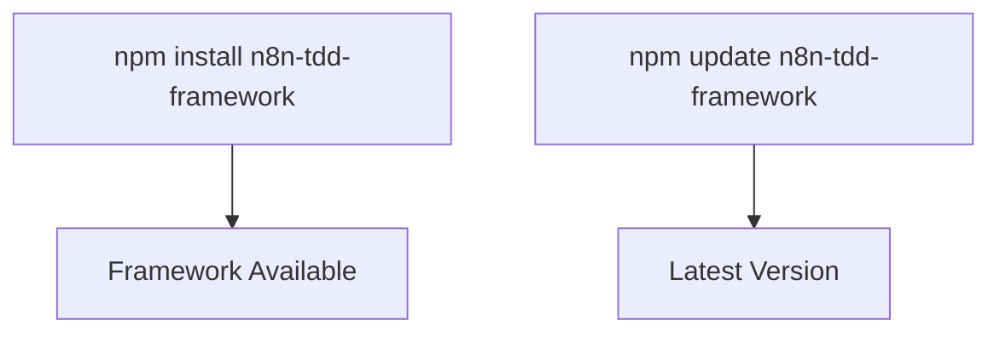
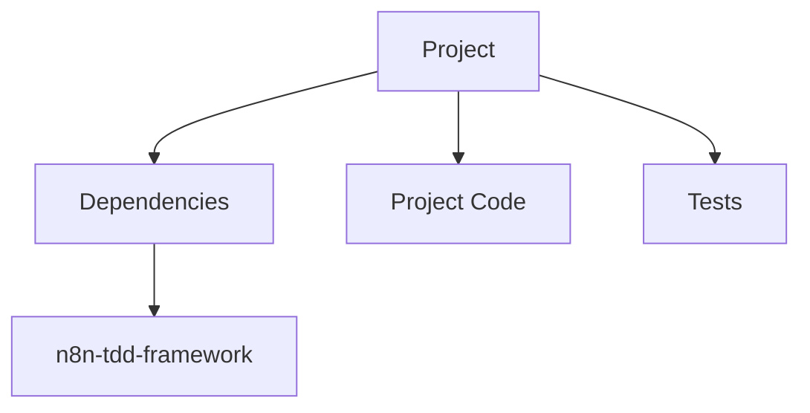
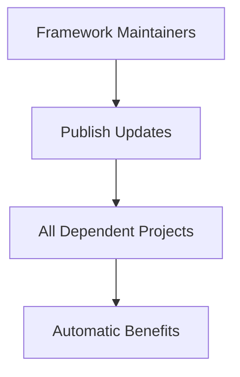
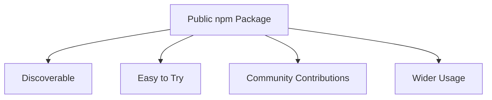
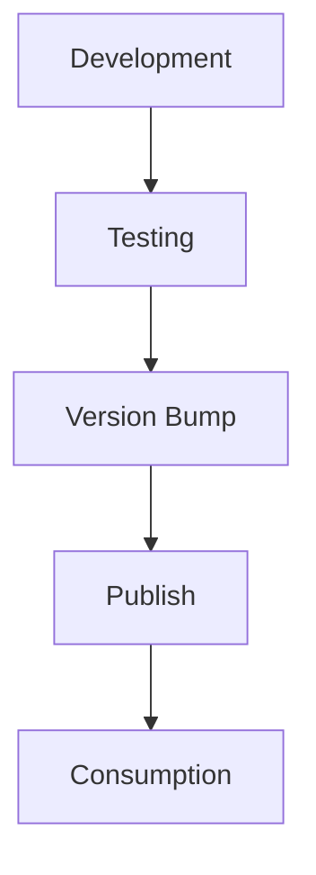

# Benefits of Packaging n8n-tdd-framework as an npm Package

## Overview

Packaging the n8n TDD framework as an npm package provides numerous advantages for both maintainers and users. This document outlines the key benefits of this approach and how it enhances the usability, maintainability, and adoption of the framework.

## Key Benefits

### 1. Simplified Installation and Updates

- **One-Command Installation**: Users can install the framework with a single `npm install` command
- **Automatic Dependency Management**: npm automatically handles all dependencies
- **Streamlined Updates**: Users can update to the latest version with `npm update`
- **Version Pinning**: Projects can pin to specific versions for stability

### 2. Improved Project Organization

- **Clear Separation**: Clear distinction between the framework and project code
- **Reduced Codebase Size**: No need to include framework code in each project
- **Focused Development**: Project developers can focus on their specific workflows
- **Standardized Structure**: Consistent approach across multiple projects

### 3. Enhanced Maintainability

- **Centralized Bug Fixes**: Fix bugs once, benefit all projects
- **Consistent Versioning**: Semantic versioning makes updates predictable
- **Isolated Testing**: Framework can be tested independently
- **Focused Documentation**: Documentation can focus on usage rather than implementation

### 4. Broader Adoption

- **Increased Visibility**: Public packages are discoverable on npm
- **Lower Barrier to Entry**: New users can quickly try the framework
- **Community Engagement**: Easier for others to contribute improvements
- **Ecosystem Integration**: Can be integrated with other tools and frameworks

### 5. Professional Development Workflow

- **CI/CD Integration**: Automated testing and publishing
- **Release Management**: Structured approach to releases
- **Changelog Tracking**: Clear history of changes
- **Issue Tracking**: Centralized issue management

### 6. Practical Advantages for n8n Projects

- **Consistent Testing Approach**: Standardized testing methodology across n8n projects
- **Reduced Duplication**: No need to recreate testing infrastructure
- **Best Practices**: Encapsulates testing best practices for n8n workflows
- **Focus on Business Logic**: Teams can focus on workflow logic rather than testing infrastructure

## Implementation Benefits

### For Framework Maintainers

- **Clear Ownership**: Defined responsibility for framework maintenance
- **Version Control**: Precise control over what gets published
- **Usage Analytics**: npm provides download statistics
- **Feedback Loop**: Issues and PRs provide direct feedback

### For Framework Users

- **Simplified Dependency**: Framework becomes a standard dependency
- **Predictable Updates**: Semantic versioning makes updates predictable
- **Documentation Access**: Documentation is standardized and accessible
- **Community Support**: Benefit from community knowledge and solutions

## Real-World Impact

Converting the n8n TDD framework to an npm package will significantly improve the development experience by:

1. **Reducing Setup Time**: New projects can be set up in minutes instead of hours
2. **Improving Consistency**: All projects use the same testing approach
3. **Facilitating Knowledge Sharing**: Common framework makes it easier to share knowledge
4. **Enabling Scalability**: Framework can evolve independently of individual projects

## Conclusion

Packaging the n8n TDD framework as an npm package transforms it from a project-specific solution to a professional, reusable tool that can benefit the broader n8n community. This approach aligns with modern JavaScript development practices and provides significant advantages for both maintainers and users.