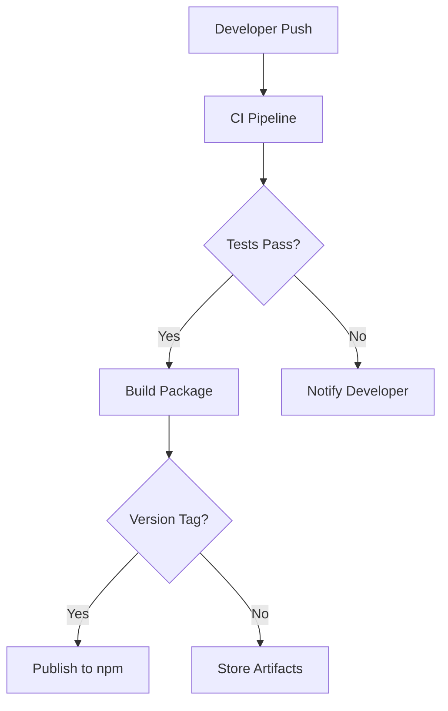

# CI/CD Strategy for n8n-tdd-framework

This document outlines the continuous integration and continuous deployment (CI/CD) strategy for the n8n-tdd-framework npm package.

## Overview



The CI/CD pipeline will automate:
1. Code quality checks
2. Testing across multiple environments
3. Building the package
4. Publishing to npm (for tagged releases)
5. Generating and publishing documentation

## GitHub Actions Workflows

### 1. Continuous Integration Workflow

**Filename**: `.github/workflows/ci.yml`

**Trigger**: Push to any branch, Pull Requests

**Purpose**: Ensure code quality and test functionality

```yaml
name: CI

on:
  push:
    branches: [ main, develop ]
  pull_request:
    branches: [ main, develop ]

jobs:
  lint:
    runs-on: ubuntu-latest
    steps:
      - uses: actions/checkout@v3
      - name: Use Node.js
        uses: actions/setup-node@v3
        with:
          node-version: '16.x'
      - name: Install dependencies
        run: npm ci
      - name: Lint code
        run: npm run lint

  test:
    needs: lint
    runs-on: ${{ matrix.os }}
    strategy:
      matrix:
        node-version: [14.x, 16.x, 18.x]
        os: [ubuntu-latest, windows-latest, macos-latest]
    
    steps:
      - uses: actions/checkout@v3
      - name: Use Node.js ${{ matrix.node-version }}
        uses: actions/setup-node@v3
        with:
          node-version: ${{ matrix.node-version }}
      - name: Install dependencies
        run: npm ci
      - name: Run tests
        run: npm test
      - name: Upload coverage
        uses: codecov/codecov-action@v3
        with:
          file: ./coverage/lcov.info

  build:
    needs: test
    runs-on: ubuntu-latest
    steps:
      - uses: actions/checkout@v3
      - name: Use Node.js
        uses: actions/setup-node@v3
        with:
          node-version: '16.x'
      - name: Install dependencies
        run: npm ci
      - name: Build package
        run: npm run build
      - name: Upload build artifacts
        uses: actions/upload-artifact@v3
        with:
          name: dist
          path: dist/
```

### 2. Release Workflow

**Filename**: `.github/workflows/release.yml`

**Trigger**: Tags matching pattern `v*.*.*`

**Purpose**: Build and publish the package to npm

```yaml
name: Release

on:
  push:
    tags:
      - 'v*.*.*'

jobs:
  build:
    runs-on: ubuntu-latest
    steps:
      - uses: actions/checkout@v3
      - name: Use Node.js
        uses: actions/setup-node@v3
        with:
          node-version: '16.x'
      - name: Install dependencies
        run: npm ci
      - name: Run tests
        run: npm test
      - name: Build package
        run: npm run build

  publish:
    needs: build
    runs-on: ubuntu-latest
    steps:
      - uses: actions/checkout@v3
      - name: Use Node.js
        uses: actions/setup-node@v3
        with:
          node-version: '16.x'
          registry-url: 'https://registry.npmjs.org'
      - name: Install dependencies
        run: npm ci
      - name: Build package
        run: npm run build
      - name: Publish to npm
        run: npm publish
        env:
          NODE_AUTH_TOKEN: ${{ secrets.NPM_TOKEN }}
      
      - name: Create GitHub Release
        uses: softprops/action-gh-release@v1
        with:
          files: |
            n8n-tdd-framework-*.tgz
          body_path: CHANGELOG.md
        env:
          GITHUB_TOKEN: ${{ secrets.GITHUB_TOKEN }}
```

### 3. Documentation Workflow

**Filename**: `.github/workflows/docs.yml`

**Trigger**: Push to main branch

**Purpose**: Generate and publish documentation

```yaml
name: Documentation

on:
  push:
    branches: [ main ]
    paths:
      - 'src/**'
      - 'docs/**'
      - '*.md'

jobs:
  build-docs:
    runs-on: ubuntu-latest
    steps:
      - uses: actions/checkout@v3
      - name: Use Node.js
        uses: actions/setup-node@v3
        with:
          node-version: '16.x'
      - name: Install dependencies
        run: npm ci
      - name: Generate API documentation
        run: npm run docs
      
      - name: Deploy to GitHub Pages
        uses: JamesIves/github-pages-deploy-action@v4
        with:
          folder: docs/api
          branch: gh-pages
```

## Release Process

### Automated Release Process

1. **Version Bump**:
   ```bash
   npm version patch  # or minor, or major
   ```
   This automatically:
   - Updates version in package.json
   - Creates a git tag
   - Commits the changes

2. **Push with Tags**:
   ```bash
   git push --follow-tags
   ```

3. **CI/CD Pipeline**:
   - GitHub Actions detects the tag
   - Runs tests
   - Builds the package
   - Publishes to npm
   - Creates a GitHub release

### Manual Release Process (Fallback)

If automated release fails:

1. **Build the package**:
   ```bash
   npm run build
   ```

2. **Create a tarball**:
   ```bash
   npm pack
   ```

3. **Publish to npm**:
   ```bash
   npm publish
   ```

## Version Management

### Semantic Versioning

The package follows [Semantic Versioning](https://semver.org/):

- **Patch** (`0.9.1`): Bug fixes and minor changes
- **Minor** (`0.10.0`): New features, backward compatible
- **Major** (`1.0.0`): Breaking changes

### Pre-releases

For pre-release versions:

```bash
npm version prerelease --preid=alpha
# Creates version like 0.9.0-alpha.0
```

## Continuous Deployment Environments

### npm Registry

- **Production**: The public npm registry
- **Testing**: Using `npm pack` to test locally before publishing

### Documentation

- **Production**: GitHub Pages
- **Development**: Local documentation server

## Security Considerations

### npm Token Security

- Store npm tokens as GitHub Secrets
- Use scoped tokens with limited permissions
- Rotate tokens periodically

### Dependency Scanning

- Use GitHub's Dependabot for security alerts
- Regularly update dependencies
- Run security audits:
  ```bash
  npm audit
  ```

## Quality Gates

Each release must pass through these quality gates:

1. **Linting**: Code style and quality checks
2. **Unit Tests**: All unit tests must pass
3. **Integration Tests**: All integration tests must pass
4. **Coverage Thresholds**: Minimum 80% code coverage
5. **Build Verification**: Package builds successfully
6. **Installation Test**: Package can be installed and imported

## Monitoring and Feedback

### Release Monitoring

- Track npm download statistics
- Monitor GitHub issues for bug reports
- Set up alerts for failed CI/CD pipelines

### User Feedback Channels

- GitHub Issues for bug reports and feature requests
- Pull Requests for community contributions
- npm package ratings and reviews

## Implementation Steps

1. **Set up GitHub Repository**:
   - Create repository for n8n-tdd-framework
   - Configure branch protection rules
   - Set up issue templates

2. **Configure GitHub Actions**:
   - Create workflow files as outlined above
   - Set up required secrets (NPM_TOKEN)

3. **Set up npm Account**:
   - Create npm account if not already available
   - Create access token for CI/CD

4. **Create Initial Release**:
   - Build and test package locally
   - Publish initial version manually
   - Verify automated process for subsequent releases

## Conclusion

This CI/CD strategy ensures that the n8n-tdd-framework package is consistently tested, built, and deployed in an automated fashion. By implementing these practices, we can maintain high quality standards while streamlining the release process.

The automated workflows handle the repetitive tasks of testing, building, and publishing, allowing developers to focus on adding features and fixing bugs. The quality gates ensure that only properly tested and functioning code is released to users.