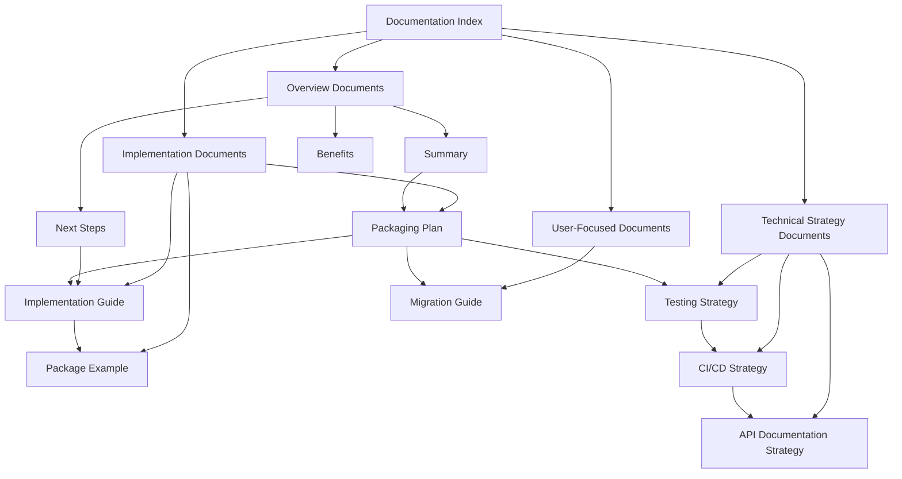

# n8n-tdd-framework Documentation Index

This document serves as a comprehensive index of all documentation created for the n8n-tdd-framework npm package planning. Use this as your starting point to navigate through the various aspects of the packaging plan.

## Overview Documents

| Document | Description |
|----------|-------------|
| [Summary](./n8n-tdd-framework-summary.md) | Executive summary of the packaging plan |
| [Benefits](./n8n-tdd-framework-benefits.md) | Detailed benefits of packaging as an npm package |
| [Next Steps](./n8n-tdd-framework-next-steps.md) | Recommended next steps and implementation roadmap |

## Implementation Documents

| Document | Description |
|----------|-------------|
| [Packaging Plan](./n8n-tdd-framework-packaging-plan.md) | Comprehensive plan for packaging the framework |
| [Implementation Guide](./n8n-tdd-framework-implementation-guide.md) | Step-by-step guide with specific npm commands |
| [Package Example](./n8n-tdd-framework-package-example.md) | Sample package.json configuration |

## Technical Strategy Documents

| Document | Description |
|----------|-------------|
| [Testing Strategy](./n8n-tdd-framework-testing-strategy.md) | Comprehensive testing approach for the package |
| [CI/CD Strategy](./n8n-tdd-framework-cicd.md) | Continuous integration and deployment strategy |
| [API Documentation Strategy](./n8n-tdd-framework-api-docs.md) | Approach for creating comprehensive API documentation |

## User-Focused Documents

| Document | Description |
|----------|-------------|
| [Migration Guide](./n8n-tdd-framework-migration-guide.md) | Guide for migrating existing projects to use the package |

## Document Relationships

## Key Topics Covered

### Package Structure and Configuration

- Directory structure
- package.json configuration
- TypeScript configuration
- Build process setup
- Entry points and exports

### Documentation

- API reference documentation
- User guides
- Examples
- TypeDoc configuration
- JSDoc comments

### Testing

- Unit testing
- Integration testing
- Package testing
- Compatibility testing
- Performance testing

### CI/CD

- GitHub Actions workflows
- Release process
- Version management
- npm publishing
- Documentation deployment

### Migration

- Dependency updates
- Import statement changes
- API adaptation
- Test file updates

## How to Use This Documentation

1. **Start with the Summary**: Get a high-level overview of the plan
2. **Review the Benefits**: Understand why this approach is valuable
3. **Explore the Packaging Plan**: Dive into the detailed implementation plan
4. **Check the Implementation Guide**: Get specific steps and commands
5. **Review Technical Strategies**: Understand testing, CI/CD, and documentation approaches
6. **Prepare for Migration**: Learn how to migrate existing projects

## Implementation Checklist

- [ ] Create GitHub repository
- [ ] Set up npm account
- [ ] Create initial project structure
- [ ] Configure package files
- [ ] Update entry points
- [ ] Create build process
- [ ] Create documentation
- [ ] Develop example projects
- [ ] Implement testing strategy
- [ ] Set up CI/CD pipeline
- [ ] Test package locally
- [ ] Publish to npm
- [ ] Monitor and support
- [ ] Gather feedback

## Conclusion

This comprehensive documentation provides a complete roadmap for packaging the n8n TDD framework as an npm package. By following these documents, you can successfully implement a professional, maintainable, and user-friendly package that will benefit the n8n community.

The modular nature of the documentation allows you to focus on specific aspects of the implementation as needed, while the relationships between documents ensure a cohesive overall plan.

To begin implementation, start with the [Next Steps](./n8n-tdd-framework-next-steps.md) document, which provides a detailed roadmap and timeline for the implementation process.