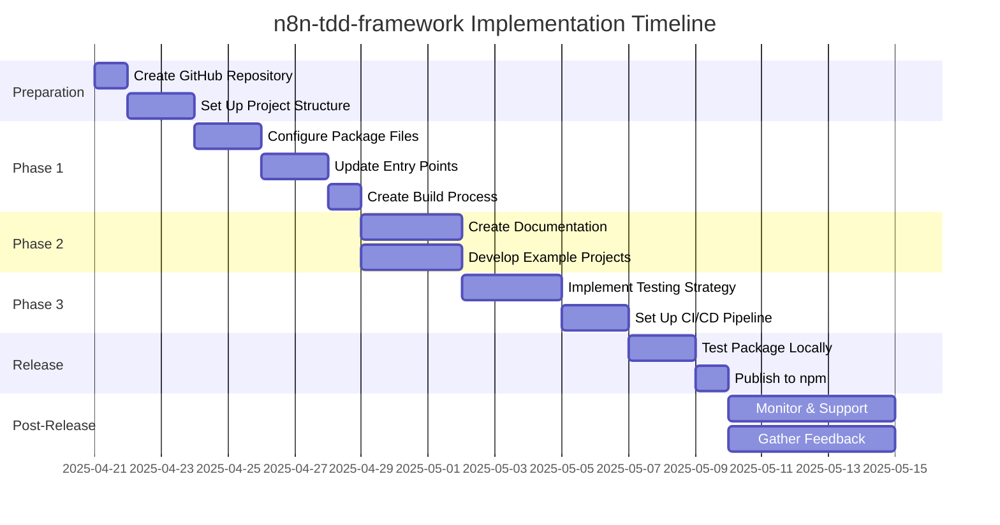

# Next Steps for n8n-tdd-framework Implementation

This document outlines the recommended next steps to move forward with implementing the n8n-tdd-framework as an npm package.

## Implementation Roadmap

## Immediate Actions (Week 1)

1. **Create GitHub Repository**
   - Create a new repository named `n8n-tdd-framework`
   - Initialize with README, LICENSE, and .gitignore
   - Set up branch protection rules for `main`

2. **Set Up npm Account**
   - Create npm account if not already available
   - Set up two-factor authentication
   - Create access token for CI/CD

3. **Create Initial Project Structure**
   - Clone repository locally
   - Set up directory structure as outlined in the implementation guide
   - Copy relevant files from the current framework

## Phase 1: Package Configuration (Week 1-2)

1. **Configure Package Files**
   - Create package.json based on the provided template
   - Set up tsconfig.json for TypeScript compilation
   - Create .npmignore to exclude development files

2. **Update Entry Points**
   - Create/update src/index.ts with proper exports
   - Ensure all necessary components are exported
   - Remove any internal or test-only exports

3. **Create Build Process**
   - Set up TypeScript compilation
   - Configure Jest for testing
   - Create npm scripts for building, testing, and publishing

## Phase 2: Documentation and Examples (Week 2-3)

1. **Create Documentation**
   - Set up TypeDoc for API documentation
   - Create comprehensive README.md
   - Write guides for common use cases
   - Document migration process for existing projects

2. **Develop Example Projects**
   - Create basic usage example
   - Create declarative testing example
   - Ensure examples are well-documented and functional

## Phase 3: Testing and CI/CD (Week 3-4)

1. **Implement Testing Strategy**
   - Set up unit tests for core functionality
   - Create integration tests for n8n interaction
   - Implement package testing to verify installation and usage

2. **Set Up CI/CD Pipeline**
   - Configure GitHub Actions for testing
   - Set up automated builds
   - Configure npm publishing for tagged releases
   - Set up documentation generation and publishing

## Release Process (Week 4)

1. **Test Package Locally**
   - Build the package
   - Create a tarball using `npm pack`
   - Test installation in a separate project
   - Verify all functionality works as expected

2. **Publish to npm**
   - Set version to 0.9.0
   - Publish to npm registry
   - Create GitHub release with release notes
   - Tag the release in git

## Post-Release Activities

1. **Monitor and Support**
   - Monitor npm downloads and GitHub activity
   - Address issues and questions
   - Provide support for early adopters

2. **Gather Feedback**
   - Collect feedback from users
   - Identify areas for improvement
   - Plan for future releases

## Key Decisions Required

Before proceeding, please confirm the following decisions:

1. **Package Name**: Confirm `n8n-tdd-framework` as the package name
2. **Initial Version**: Confirm 0.9.0 as the initial version
3. **License**: Confirm ISC license (or specify alternative)
4. **Repository Location**: Confirm GitHub organization/username for hosting
5. **Documentation Hosting**: Confirm GitHub Pages for documentation hosting

## Resource Requirements

To successfully implement this plan, you will need:

1. **Development Resources**:
   - 1-2 developers familiar with the framework
   - 3-4 weeks of development time

2. **Technical Requirements**:
   - GitHub account with repository creation permissions
   - npm account with publishing permissions
   - Development environment with Node.js and npm

3. **Knowledge Requirements**:
   - TypeScript and JavaScript expertise
   - npm package development experience
   - CI/CD configuration knowledge
   - Documentation writing skills

## Risk Assessment and Mitigation

| Risk | Impact | Likelihood | Mitigation |
|------|--------|------------|------------|
| Breaking changes in API | High | Medium | Thorough testing, clear migration guide |
| Compatibility issues with n8n versions | High | Medium | Test with multiple n8n versions, document compatibility |
| Incomplete documentation | Medium | Low | Follow documentation strategy, peer review |
| Low adoption by users | Medium | Low | Promote benefits, provide examples and support |
| npm publishing issues | Medium | Low | Test publishing process, have backup plan |

## Success Criteria

The implementation will be considered successful when:

1. The package is published to npm and installable via `npm install n8n-tdd-framework`
2. All core functionality works as expected
3. Documentation is comprehensive and accessible
4. Existing projects can migrate to the package with minimal effort
5. CI/CD pipeline is functioning for automated testing and publishing

## Conclusion

By following this implementation plan, you can successfully package the n8n TDD framework as an npm package, making it more accessible, maintainable, and useful for the community. The phased approach allows for incremental progress and validation at each step.

The comprehensive documentation created during the planning phase provides a solid foundation for implementation. Refer to the following documents for detailed guidance:

1. [Detailed Implementation Plan](./n8n-tdd-framework-packaging-plan.md)
2. [Implementation Guide](./n8n-tdd-framework-implementation-guide.md)
3. [Package Example](./n8n-tdd-framework-package-example.md)
4. [Testing Strategy](./n8n-tdd-framework-testing-strategy.md)
5. [CI/CD Strategy](./n8n-tdd-framework-cicd.md)
6. [API Documentation Strategy](./n8n-tdd-framework-api-docs.md)
7. [Migration Guide](./n8n-tdd-framework-migration-guide.md)
8. [Benefits Overview](./n8n-tdd-framework-benefits.md)

With these resources and the outlined plan, you are well-equipped to proceed with the implementation of the n8n-tdd-framework npm package.