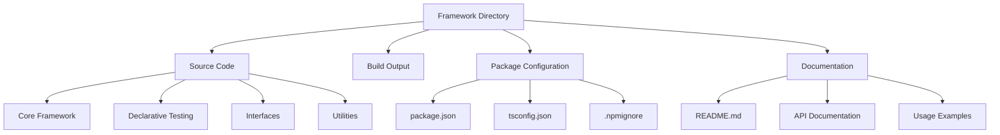

# Detailed Implementation Plan for n8n-tdd-framework

This document outlines the plan for packaging the n8n TDD framework as a public npm package named "n8n-tdd-framework" with version 0.9.0, including the core framework and declarative testing but excluding mock implementations and test utilities.

## 1. Prepare the Framework Package Structure



### 1.1 Restructure the Framework Directory

1. Create a clean directory structure:
   - `/src` - Source code
   - `/dist` - Compiled output (will be generated)
   - `/docs` - Documentation
   - `/examples` - Usage examples

2. Move relevant files from the current structure to the new one, excluding mock implementations and test utilities.

## 2. Configure Package Files

### 2.1 Update package.json

```json
{
  "name": "n8n-tdd-framework",
  "version": "0.9.0",
  "description": "A Test-Driven Development framework for n8n workflows",
  "main": "dist/index.js",
  "types": "dist/index.d.ts",
  "files": [
    "dist",
    "README.md",
    "LICENSE"
  ],
  "scripts": {
    "build": "tsc",
    "clean": "rimraf dist",
    "prebuild": "npm run clean",
    "prepare": "npm run build",
    "test": "jest --config jest.config.js",
    "lint": "eslint 'src/**/*.ts'",
    "lint:fix": "eslint 'src/**/*.ts' --fix"
  },
  "keywords": [
    "n8n",
    "workflow",
    "automation",
    "testing",
    "tdd"
  ],
  "author": "",
  "license": "ISC",
  "repository": {
    "type": "git",
    "url": "https://github.com/yourusername/n8n-tdd-framework"
  },
  "dependencies": {
    "ajv": "^8.12.0",
    "ajv-formats": "^2.1.1",
    "axios": "^1.8.4",
    "dotenv": "^16.4.7"
  },
  "devDependencies": {
    "@types/jest": "^29.5.14",
    "@typescript-eslint/eslint-plugin": "^8.29.1",
    "@typescript-eslint/parser": "^8.29.1",
    "eslint": "^9.24.0",
    "eslint-plugin-unused-imports": "^4.1.4",
    "jest": "^29.7.0",
    "rimraf": "^5.0.0",
    "ts-jest": "^29.3.0",
    "ts-node": "^10.9.2",
    "typescript": "^5.8.2"
  },
  "engines": {
    "node": ">=14.0.0"
  }
}
```

### 2.2 Configure tsconfig.json

```json
{
  "compilerOptions": {
    "target": "es2018",
    "module": "commonjs",
    "declaration": true,
    "outDir": "./dist",
    "strict": true,
    "esModuleInterop": true,
    "skipLibCheck": true,
    "forceConsistentCasingInFileNames": true,
    "resolveJsonModule": true
  },
  "include": ["src/**/*"],
  "exclude": ["node_modules", "**/*.test.ts", "src/testing/mocks/**/*"]
}
```

### 2.3 Create .npmignore

```
# Source
src/
tests/

# Configuration
tsconfig.json
jest.config.js
.eslintrc.js

# Development
coverage/
.github/
.vscode/

# Logs
*.log
npm-debug.log*

# Misc
.DS_Store
```

## 3. Update Entry Points and Exports

### 3.1 Create/Update src/index.ts

```typescript
// Core exports
export { default as WorkflowManager } from './workflows/manager';
export { default as N8nClient } from './clients/realN8nClient';

// Interfaces
export * from './interfaces/n8nClient';
export * from './testing/types';

// Declarative testing
export * from './workflows/testing/declarative/runner';
export * from './workflows/testing/declarative/testCreator';
export * from './workflows/testing/declarative/types';
export * from './workflows/testing/declarative/validator';

// Utilities
export * from './utils/n8nClient';
export * from './config/config';

// CLI exports
export { default as WorkflowCLI } from './workflows/cli';
```

## 4. Build Process Implementation

1. Create a build script that:
   - Cleans the dist directory
   - Compiles TypeScript to JavaScript
   - Generates type declarations
   - Copies necessary files (like JSON schemas)

2. Add a prepare script to automatically build before publishing

## 5. Documentation Updates

### 5.1 Create a comprehensive README.md

```markdown
# n8n-tdd-framework

A Test-Driven Development framework for n8n workflows.

## Installation

```bash
npm install n8n-tdd-framework
```

## Features

- Create, read, update, and delete n8n workflows
- Import and export workflows to/from files
- Template-based workflow creation
- Declarative workflow testing
- CI/CD integration

## Usage

### Basic Usage

```typescript
import { WorkflowManager } from 'n8n-tdd-framework';

// Create a workflow manager
const manager = new WorkflowManager();

// List all workflows
const workflows = await manager.listWorkflows();
console.log(`Found ${workflows.length} workflow(s)`);
```

### Declarative Testing

```typescript
import { DeclarativeTestRunner } from 'n8n-tdd-framework';

// Create a test runner
const runner = new DeclarativeTestRunner();

// Run tests from a file
const results = await runner.runTestsFromFile('path/to/tests.json');
console.log(`Tests: ${results.passed}/${results.total} passed`);
```

## Documentation

For detailed documentation, see [the documentation](https://github.com/yourusername/n8n-tdd-framework/docs).
```

### 5.2 Create API Documentation

Generate API documentation using TypeDoc or similar tools.

## 6. Example Project

Create an example project that demonstrates how to use the package:

```
examples/
  basic-usage/
    package.json
    index.js
  declarative-testing/
    package.json
    tests/
      example-test.json
    index.js
```

## 7. Testing the Package

1. Create a test script that:
   - Builds the package
   - Creates a tarball using `npm pack`
   - Installs the tarball in a test project
   - Runs basic tests to verify functionality

2. Test in different Node.js environments

## 8. Publishing Process

1. Create an npm account if you don't have one
2. Login to npm: `npm login`
3. Publish the package: `npm publish`
4. Create a GitHub repository for the package
5. Push the code to GitHub

## 9. Continuous Integration

Set up GitHub Actions for:
1. Running tests on push
2. Building the package
3. Publishing to npm on release

## 10. Versioning and Maintenance

1. Use Semantic Versioning:
   - Patch (0.9.1): Bug fixes
   - Minor (0.10.0): New features, backward compatible
   - Major (1.0.0): Breaking changes

2. Maintain a CHANGELOG.md to track changes

## Implementation Timeline

1. **Week 1: Package Structure and Configuration**
   - Restructure the framework directory
   - Configure package.json, tsconfig.json, and .npmignore
   - Update entry points and exports

2. **Week 2: Build Process and Documentation**
   - Implement the build process
   - Create comprehensive documentation
   - Create example projects

3. **Week 3: Testing and Publishing**
   - Test the package in different environments
   - Publish to npm
   - Set up continuous integration

## Implementation Steps

Here's a step-by-step guide to implement this plan:

### Step 1: Create a New Package Directory

```bash
# Create a new directory for the package
mkdir n8n-tdd-framework
cd n8n-tdd-framework

# Initialize git repository
git init

# Initialize npm package
npm init
```

### Step 2: Copy Relevant Files from the Framework

```bash
# Create directory structure
mkdir -p src/clients src/config src/interfaces src/testing src/utils src/workflows
mkdir -p src/workflows/testing/declarative
mkdir -p docs examples

# Copy relevant files from the original framework
# (This will need to be done manually to ensure only the necessary files are copied)
```

### Step 3: Configure Package Files

Create the package.json, tsconfig.json, and .npmignore files as specified above.

### Step 4: Update Entry Points

Create/update src/index.ts with the exports as specified above.

### Step 5: Implement Build Process

```bash
# Install development dependencies
npm install --save-dev typescript rimraf @types/node

# Create build scripts in package.json
```

### Step 6: Create Documentation

Create README.md and other documentation files.

### Step 7: Create Example Projects

Create example projects in the examples directory.

### Step 8: Test the Package

```bash
# Build the package
npm run build

# Create a tarball
npm pack

# Test in a separate project
mkdir test-project
cd test-project
npm init -y
npm install ../n8n-tdd-framework-0.9.0.tgz
```

### Step 9: Publish to npm

```bash
# Login to npm
npm login

# Publish the package
npm publish
```

### Step 10: Set Up Continuous Integration

Create GitHub Actions workflows for CI/CD.