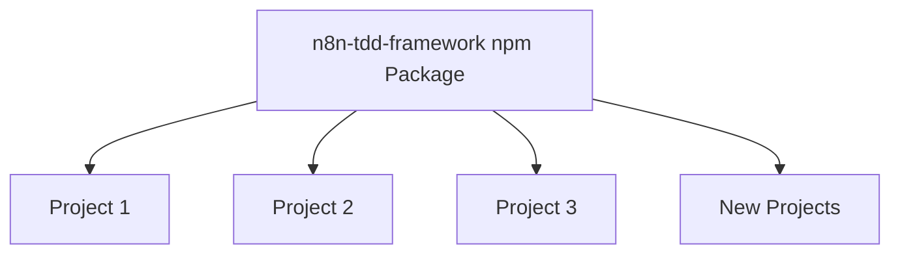

# n8n-tdd-framework: Packaging Plan Summary

## Executive Summary

This document summarizes the plan to package the n8n TDD framework as a public npm package named `n8n-tdd-framework`. The goal is to make the framework easily reusable across multiple projects through standard npm commands, improving maintainability, adoption, and development workflow.

## Current State

The n8n TDD framework currently exists as part of a larger project with the following structure:

- `/framework`: Core framework code
- `/usage`: Example usage of the framework
- `/docs`: Documentation

The framework provides tools for:
- Creating and managing n8n workflows
- Testing workflows using declarative JSON configurations
- Validating workflow outputs with assertions
- Managing test resources automatically

Currently, projects use the framework via local file references, which creates maintenance challenges and limits reusability.

## Target State

The framework will be packaged as a standalone npm package that:

1. Is installable via `npm install n8n-tdd-framework`
2. Provides a clean, well-documented API
3. Follows semantic versioning for predictable updates
4. Includes TypeScript type definitions
5. Contains comprehensive documentation
6. Offers example projects demonstrating usage

## Key Components

The package will include:

- **Core Framework**: Workflow management functionality
- **Declarative Testing**: JSON-based test configuration
- **Interfaces & Types**: TypeScript definitions
- **Utilities**: Helper functions for common tasks

Excluded components:
- Mock implementations
- Test utilities specific to the framework itself

## Implementation Plan

The implementation plan consists of four main phases:

### Phase 1: Package Structure and Configuration

- Create a clean directory structure
- Configure package.json, tsconfig.json, and .npmignore
- Update entry points and exports

### Phase 2: Build Process and Documentation

- Implement the build process
- Create comprehensive documentation
- Create example projects

### Phase 3: Testing and Publishing

- Test the package in different environments
- Publish to npm
- Set up continuous integration

### Phase 4: Migration Support

- Create migration guides for existing projects
- Provide support for transitioning projects

## Benefits

Packaging the framework as an npm package provides numerous benefits:

1. **Simplified Installation**: One-command installation
2. **Improved Project Organization**: Clear separation between framework and project code
3. **Enhanced Maintainability**: Centralized bug fixes and improvements
4. **Broader Adoption**: Lower barrier to entry for new users
5. **Professional Development Workflow**: CI/CD integration and release management
6. **Consistent Testing Approach**: Standardized methodology across projects

## Implementation Timeline

- **Week 1**: Package structure and configuration
- **Week 2**: Build process and documentation
- **Week 3**: Testing and publishing

## Documentation Created

The following documentation has been created to support this plan:

1. [Detailed Implementation Plan](./n8n-tdd-framework-packaging-plan.md): Comprehensive plan for packaging the framework
2. [Implementation Guide](./n8n-tdd-framework-implementation-guide.md): Step-by-step guide with specific npm commands
3. [Package Example](./n8n-tdd-framework-package-example.md): Sample package.json configuration
4. [Benefits Overview](./n8n-tdd-framework-benefits.md): Detailed benefits of this approach
5. [Migration Guide](./n8n-tdd-framework-migration-guide.md): Instructions for migrating existing projects

## Next Steps

1. Review the detailed implementation plan
2. Approve the approach and timeline
3. Begin implementation with Phase 1
4. Set up a GitHub repository for the package
5. Create an npm account for publishing

## Conclusion

Packaging the n8n TDD framework as an npm package represents a significant improvement in how the framework is distributed, maintained, and used. This approach aligns with modern JavaScript development practices and will provide substantial benefits for both maintainers and users.

The comprehensive documentation provided offers a clear roadmap for implementation, ensuring a smooth transition to the new package-based approach.